## Content

* [Setup on Github Codespaces](./01_setup_installation.md#setup-on-github-codespaces-recommended)
* [Local Development Setup](./01_setup_installation.md#local-development-setup)
* [Docker Container Setup](./01_setup_installation.md#docker-container-setup)

# ROHD Setup & Installation

There are three ways to develop with ROHD. The first option is to run it on GitHub Codespaces, while the other two options are to set it up on your local machine or run it through a Docker container on your local machine. These options provide different levels of flexibility and customization to suit your development needs.

## Setup on Github Codespaces (Recommended)

### Step 1: Click on the CodeSpaces Button

To access the Codespaces feature on the <https://github.com/intel/rohd> repository, simply click on the "Codespaces" button.

Please note that Codespaces are free for all users with a personal GitHub account that have either a Free or Pro plan. However, there is a monthly usage limit. To learn more about this feature, visit the official GitHub Codespaces Overview page at <https://docs.github.com/en/codespaces/overview>.

> All personal GitHub.com accounts have a monthly quota of free use of GitHub Codespaces included in the Free or Pro plan. You can get started using GitHub Codespaces on your personal account without changing any settings or providing payment details. You can create and use a codespaces for any repository you can clone. You can also use a template to create codespaces that are not initially associated with a repository. If you create a codespaces from an organization-owned repository, use of the codespaces will either be charged to the organization (if the organization is configured for this), or to your personal account. Codespaces created from templates are always charged to your personal account. You can continue using GitHub Codespaces beyond your monthly included storage and compute usage by providing payment details and setting a spending limit. For more information, see "About billing for GitHub Codespaces.

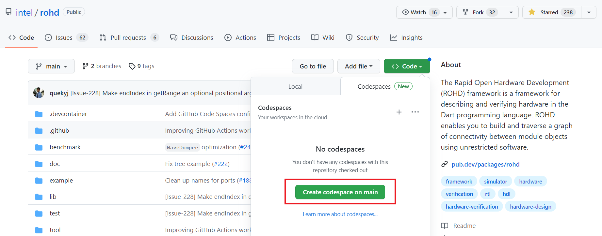

### Step 2: Build Container

You will be redirected to a page where GitHub will initiate the launch of your container. Please allow some time for GitHub to establish your server.

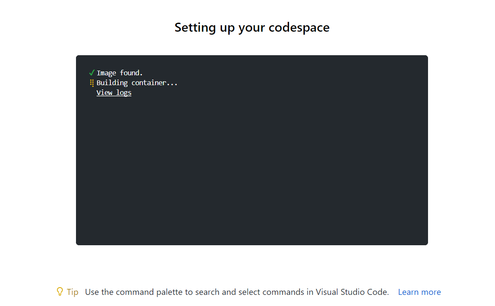

### Step 3: VSCode in Browser

When your space is ready, you will see a visual studio code running on your browser.

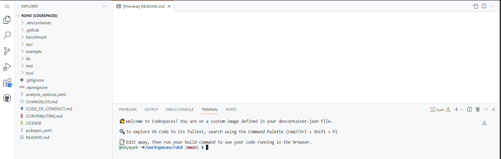

### Step 4: Dart pub get

Run `dart pub get` on the terminal of the visual studio code to pull your setup.

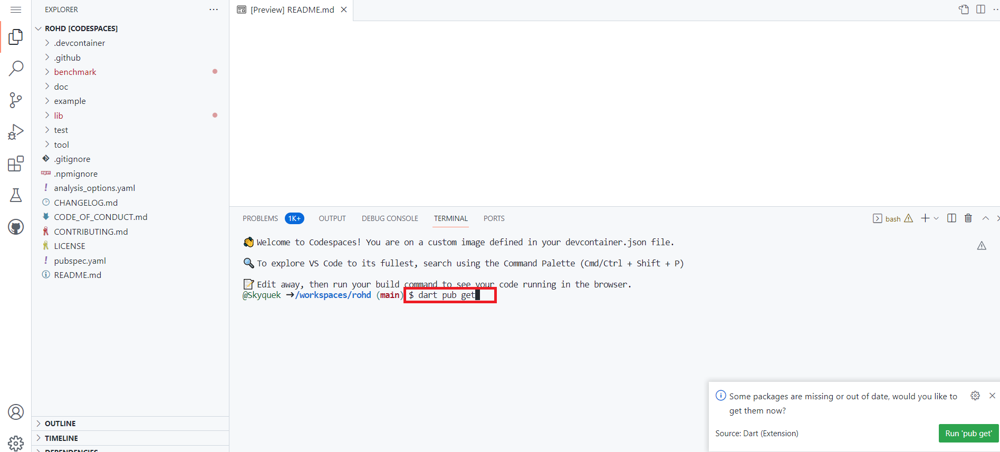

### Step 5: Run the example code

Open up `example` folder on the left navigation panel and click on `example.dart` to bring forward the first example of ROHD. After that, navigate to the main function at below of line 58 and click on the `Run` at `Run | Debug`.

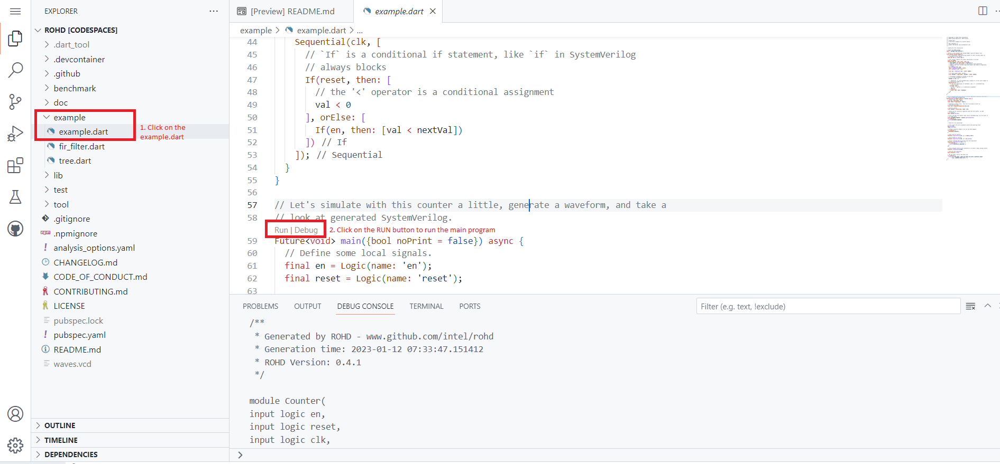

If you can see SystemVerilog code pop up on the terminal. Well, you have successfully set up your development environment on the cloud.

### Step 6: Delete the CodeSpaces (Optional)

To delete the codespaces, go back to <https://github.com/intel/rohd> and click on codespaces just like step 1. But this time, you will see more options. Click on the `delete` option to delete codespaces.

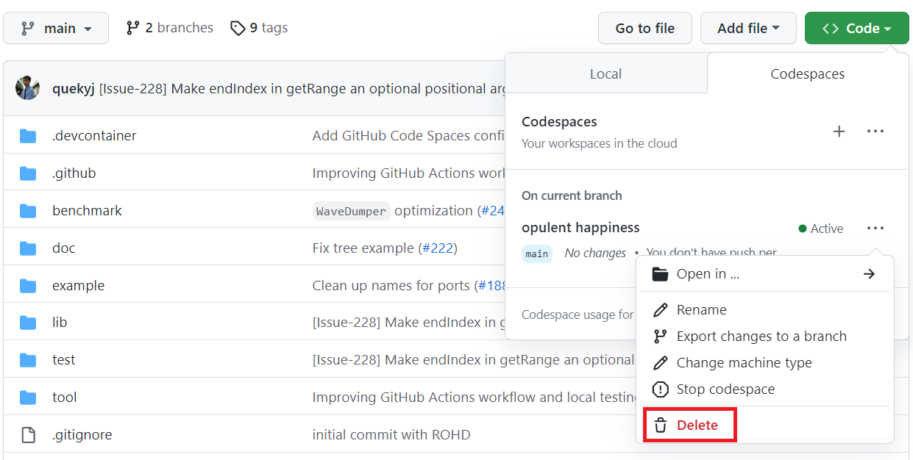

## Local Development Setup

ROHD can be install in **Windows**, **Mac**, or **Linux** machine.

**Pre-requiresite:**

* Install Chocolatey (Dart SDK might require installation of chocolatey)
  * <https://chocolatey.org/install#individual>
* Install latest `dart` SDK from official dart website:
  * <https://dart.dev/get-dart>
* Install Visual Studio Code
  * <https://code.visualstudio.com/Download>

### Option 1: Install from Dart packages

Open up a terminal and create a new dart project. Note that do not create the project with the name `rohd` as we will depend on the package later.

```shell
dart create -t console rohd-project
```

Then `cd` to the created `rohd` directory.

```shell
cd rohd-project
```

Install ROHD using `dart pub add rohd` command.

```shell
dart pub add rohd
```

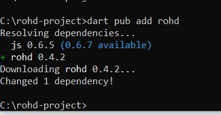

Then, open up vscode

```shell
code .
```

Delete all the content in `bin/rohd_project.dart` and replace with:

```dart
// ignore_for_file: avoid_print

// Import the ROHD package
import 'package:rohd/rohd.dart';

// Define a class Counter that extends ROHD's abstract Module class
class Counter extends Module {
  // For convenience, map interesting outputs to short variable names for
  // consumers of this module
  Logic get val => output('val');

  // This counter supports any width, determined at run-time
  final int width;
  Counter(Logic en, Logic reset, Logic clk,
      {this.width = 8, super.name = 'counter'}) {
    // Register inputs and outputs of the module in the constructor.
    // Module logic must consume registered inputs and output to registered
    // outputs.
    en = addInput('en', en);
    reset = addInput('reset', reset);
    clk = addInput('clk', clk);

    final val = addOutput('val', width: width);

    // A local signal named 'nextVal'
    final nextVal = Logic(name: 'nextVal', width: width);

    // Assignment statement of nextVal to be val+1
    // (<= is the assignment operator)
    nextVal <= val + 1;

    // `Sequential` is like SystemVerilog's always_ff, in this case trigger on
    // the positive edge of clk
    Sequential(clk, [
      // `If` is a conditional if statement, like `if` in SystemVerilog
      // always blocks
      If(reset, then: [
        // the '<' operator is a conditional assignment
        val < 0
      ], orElse: [
        If(en, then: [val < nextVal])
      ])
    ]);
  }
}

// Let's simulate with this counter a little, generate a waveform, and take a
// look at generated SystemVerilog.
Future<void> main({bool noPrint = false}) async {
  // Define some local signals.
  final en = Logic(name: 'en');
  final reset = Logic(name: 'reset');

  // Generate a simple clock.  This will run along by itself as
  // the Simulator goes.
  final clk = SimpleClockGenerator(10).clk;

  // Build a counter.
  final counter = Counter(en, reset, clk);

  // Before we can simulate or generate code with the counter, we need
  // to build it.
  await counter.build();

  // Let's see what this module looks like as SystemVerilog, so we can pass it
  // to other tools.
  final systemVerilogCode = counter.generateSynth();
  if (!noPrint) {
    print(systemVerilogCode);
  }

  // Now let's try simulating!

  // Let's start off with a disabled counter and asserting reset.
  en.inject(0);
  reset.inject(1);

  // Attach a waveform dumper so we can see what happens.
  if (!noPrint) {
    WaveDumper(counter);
  }

  // Drop reset at time 25.
  Simulator.registerAction(25, () => reset.put(0));

  // Raise enable at time 45.
  Simulator.registerAction(45, () => en.put(1));

  // Print a message when we're done with the simulation!
  Simulator.registerAction(100, () {
    if (!noPrint) {
      print('Simulation completed!');
    }
  });

  // Set a maximum time for the simulation so it doesn't keep running forever.
  Simulator.setMaxSimTime(100);

  // Kick off the simulation.
  await Simulator.run();

  // We can take a look at the waves now.
  if (!noPrint) {
    print('To view waves, check out waves.vcd with a waveform viewer'
        ' (e.g. `gtkwave waves.vcd`).');
  }
}
```

Finally, run the main function and observe if you can see the SystemVerilog code generated by running the command:

```shell
dart run
```

Well done! Your setup has been completed successfully. The successful generation of SystemVerilog code confirms that your configuration is in good order.

### Option 2: Install from Source

Clone ROHD repository to the local directory. (Install From Source). On your terminal, run

```shell
cd C:\
git clone https://github.com/intel/rohd.git
```

Next, open up your repository in VSCode using the command:

```shell
code rohd
```

You will see VSCode automatically open up your ROHD folder.

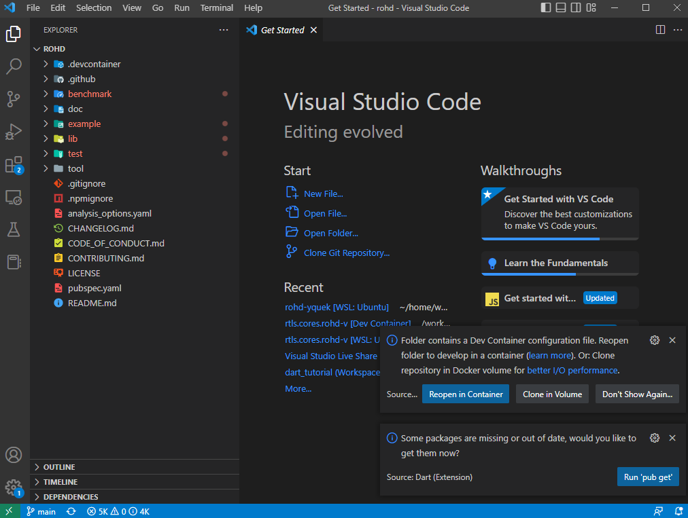

Open up terminal in your VSCode by go to view -> terminal. Then, get the rohd package downloaded using the command below.

```cmd
dart pub get
```

Then, run Rohd example.

Open up `example` folder on the left navigation panel and click on `example.dart` to bring forward the first example of ROHD. After that, navigate to the main function at below of line 58 and click on the `Run` at `Run | Debug`.

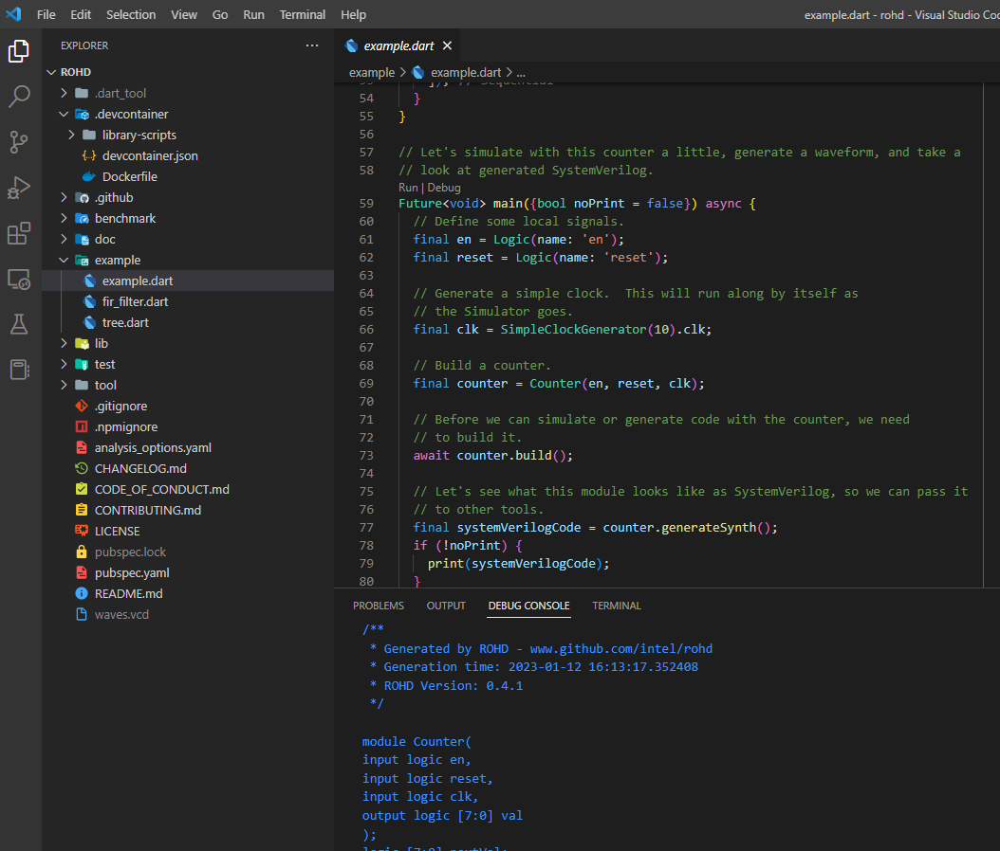

If you can see SystemVerilog code pop up on the terminal. Congratulation, you are ready with ROHD development!

## Docker Container Setup

There are another options which is to setup on lcoal docker environment. Firstly, you must install docker in your PC.

Pre-requisites:

* Install docker
  * <https://docs.docker.com/get-docker>

Then, you need to clone rohd repository to your local PC.

```shell
cd C:\
git clone https://github.com/intel/rohd.git
cd rohd
```

After clone, bring up the VSCode by run this command on your terminal:

```shell
code .
```

At this phase, assume that you already install docker on your pc. You can install docker vscode extension.

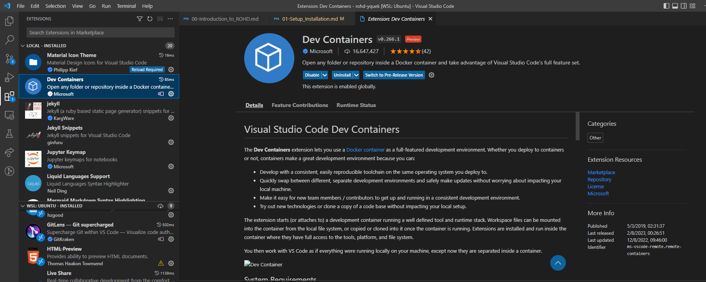

Once the extension installed. You might have to refresh your repository by restart vscode and you will see a pop up on the bottom corner right. Click on the little notification icon and clone in volume.

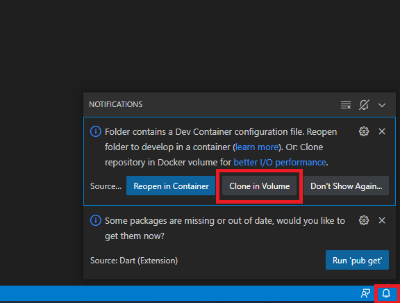

When the setting finished, you can bring up the terminal by navigate to top navigation panel **view -> terminal**.

In the terminal, run:

```shell
dart example/example.dart
```

If you can see SystemVerilog code pop up on the terminal. Congratulation, you are ready with ROHD development!

----------------
2023 February 13
Author: Yao Jing Quek <<yao.jing.quek@intel.com>>

Copyright (C) 2021-2023 Intel Corporation
SPDX-License-Identifier: BSD-3-Clause
