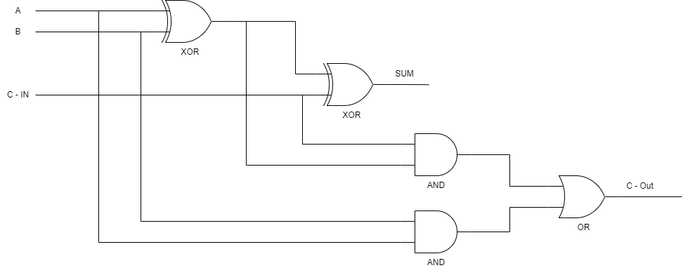

## Content

- [Introduction to Test Driven Development](./00_unit_test.md#introduction-to-test-driven-development)
- [What is a Full-Adder?](./00_unit_test.md#what-is-a-full-adder)
- [Create a Full-Adder with TDD](./00_unit_test.md#create-full-adder-with-tdd)

## Learning Outcome

In this chapter:

- You learn how to create a unit test in dart, one of the most useful test packages to check for your functionality. You will be using test driven development (TDD) to construct a full-adder.

## Introduction to Test Driven Development

ROHD encourages the use of test-driven development (TDD) when designing or developing programs. In this module, we will explore how to implement TDD using the Dart programming language.

TDD is a software development approach in which test cases are created to specify and validate the expected behavior of the code. Essentially, test cases for each piece of functionality are written and executed before writing any code. If the test fails, new code is written until it passes the test, resulting in simpler and bug-free code.

## What is a Full-Adder?

A Full Adder is an adder that takes three inputs and produces two outputs: the first two inputs are A and B, while the third input is a carry-in (C-IN). The output carry is designated as C-OUT, while the normal output is designated as S (SUM). A Full Adder logic is designed to handle up to eight inputs to create a byte-wide adder and can cascade the carry bit from one adder to another. We use a Full Adder when a carry-in bit is available because a 1-bit half-adder cannot take a carry-in bit, and another 1-bit adder must be used instead. A 1-bit Full Adder adds three operands and generates a 2-bit result.

Below is the circuit diagram of full-adder. From the diagram, we can see that the output `SUM` is the result of `XOR(XOR(A, B), C-IN)`, while `C-Out` is the result of `OR(AND(C-IN, XOR(A, B)), AND(B, A))`.



The truth table of full-adder are shown below:

| A | B | C-IN | SUM | C-Out |
| -- | -- | -- | -- | -- |
| 0 | 0 | 0 | 0 | 0 |
| 0 | 0 | 1 | 1 | 0 |
| 0 | 1 | 0 | 1 | 0 |
| 0 | 1 | 1 | 0 | 1 |
| 1 | 0 | 0 | 1 | 0 |
| 1 | 0 | 1 | 0 | 1 |
| 1 | 1 | 0 | 0 | 1 |
| 1 | 1 | 1 | 1 | 1 |

## Create Full-Adder with TDD

Before we start our development, we need to import test and rohd packages. Then, we want to create a main function.

```dart
import 'package:rohd/rohd.dart';
import 'package:test/test.dart';

void main() {
    // your rohd implmentation here!
}
```

### Failing and passing test

In TDD, we start by creating a **failing test**. Let create a test case that test for xor function.

In dart test, a test function require a string description and a function body (Minimal to make the test work).

The `expect` function will takes on a `actual` and a `matcher` which also mean value that are return from your function (actual) and value that you expect to return (matcher).

To create a test in dart:

```dart
test('should return xor results correctly in a xor b', () async {
    for (var i = 0; i <= 1; i++) {
      for (var j = 0; j <= 1; j++) {
        expect(xorAB, i == j ? 0 : 1);
      }
    }
});
```

By now, you will encounters some errors when you run that code. Keep calm, everything is under control. Let us now fix that errors.

Let start by define the logic initialization and the `xor` operators.

```dart
final a = Logic(name: 'a');
final b = Logic(name: 'b');

final xorAB = a ^ b;

test('should return xor results correctly in a xor b', () async {
    for (var i = 0; i <= 1; i++) {
      for (var j = 0; j <= 1; j++) {
        a.put(i);
        b.put(j);

        // Note: We now change make sure instead of getting the Logic,
        // We want to get the LogicValue of Int instead.
        expect(xorAB.value.toInt(), i == j ? 0 : 1);
      }
    }
});
```

## Create the function of SUM

Now, you know how to create a test in dart and ROHD. It's time to dive in deeper to create `SUM` function.

The function of `SUM` is represented in `XOR(XOR(A, B), C-IN)` where we can make it into:

```dart
final a = Logic(name: 'a');
final b = Logic(name: 'b');

// XOR(XOR(A, B), C-IN)
final xorAB = a ^ b;
final sum = xorAB ^ cIn;

test('should return true if results sum similar to truth table.', () async {
    for (var i = 0; i <= 1; i++) {
      for (var j = 0; j <= 1; j++) {
        for (var k = 0; k <= 1; k++) {
          a.put(i);
          b.put(j);
          cIn.put(k);

          expect(sum.value.toInt(), faTruthTable(i, j, k).sum);
        }
      }
    }
});
```

## Create the function of C-Out

Now, we created the c-out function. Let continue to work on the c-out function. The function of `C-Out` is represented in `OR(AND(C-IN, XOR(A, B)), AND(B, A))` where we can make it into:

```dart
// OR(AND(C-IN, XOR(A, B)), AND(B, A))
final cOut = (xorAB & cIn) | (a & b);

test('should return true if result c-out is similar to truth table.', () async {
    for (var i = 0; i <= 1; i++) {
        for (var j = 0; j <= 1; j++) {
            for (var k = 0; k <= 1; k++) {
                a.put(i);
                b.put(j);
                cIn.put(k);

                expect(cOut.value.toInt(), faTruthTable(i, j, k).cOut);
            }
        }
    }
});
```

Yeah, thats it. Congratulations! We have now successfully created a Full-Adder. You can find the executable code at [full_adder.dart](./full_adder.dart).
