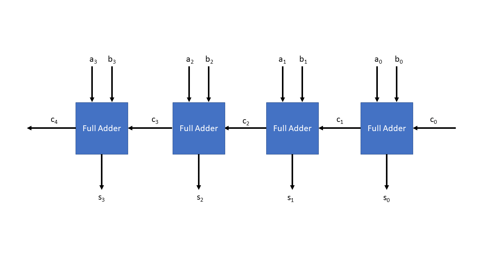
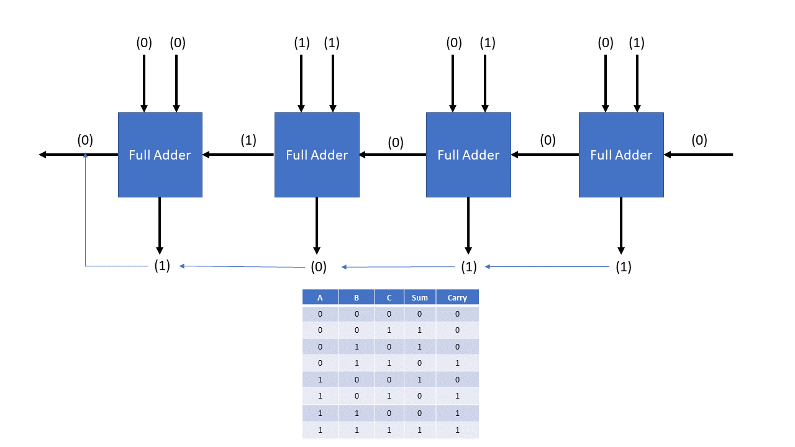

# Content

- [What is n-bit adder?](./00_basic_generation.md#what-is-n-bit-adder)
- [Create a unit-test](./00_basic_generation.md#create-a-unit-test)
- [Create Dart function and class](./00_basic_generation.md#create-dart-function-and-class)
- [Exercise](./00_basic_generation.md#exercise)

## Learning Outcome

In this chapter:

- You learn how to create an n-bit adder by utilizing dart function and class. You will start by writting unit test and slowly implement the function of the n-bit adder.

## What is n-bit adder?



The N-bit adder is a common component in many digital systems, and is used to perform arithmetic operations on binary numbers. It consists of N full-adders connected in series, with the carry-out from each full-adder feeding into the carry-in of the next.

N-Bit adder is designed by connecting full adders in series. The figure below shows 4-bit adder. The `a` and `b` is the input binary, `c` is the carry, and `s` is the sum.



So, let say we have:

`a = 0100`
`b = 0111`

The result of n-bit adder from `a`, `b` will be:

`s = 1011`

## Create a unit test

Let's begin by creating a `main()` function that takes two inputs `Logic a` and `Logic b`.

We also want to create a function that encapsulates the logic of the `nBitAdder`. Our `nBitAdder()` will take on 2 inputs `Logic a`, and `Logic b` and return a `Logic` value. As of now, we can just simply return `Const(0)` as a placeholder.

We can also create an output variable called `sum`, which represent the final value generated by our `nBitAdder` function. We can assign the return value of the `nBitAdder` function to the `sum` variable using the expression `final sum = nBitAdder(a, b)`. This means that the `sum` variable will contain the output value of the `nBitAdder` function.

Next, let create our unit test that expect to see integer of 10 when both input is 5. The code snippet below shows the implementation.

```dart
import 'package:rohd/rohd.dart';
import 'package:test/test.dart';

void main() {
  final a = Logic(name: 'a', width: 8);
  final b = Logic(name: 'a', width: 8);

  final sum = nBitAdder(a, b);

  test('should return 10 when both input is 5', () {
    a.put(5);
    b.put(5);

    expect(sum.value.toInt(), equals(10));
  });
}

Logic nBitAdder(Logic a, Logic b) {
  return Const(0);
}
```

Well, if you run the code, you will see that the test fails because it expects the value of 10 instead of our hardcoded value of 0. However, this is not a problem as we can make it work in the next step

## Create Dart function and class

If we look back at the n-bit adder diagram from the previous section, we can see that the n-bit adder is simply a repetition of the single full-adder from our previous tutorial.

So, let's start by creating a `fullAdder` function that takes in three inputs: `Logic a`, `Logic b`, and `carryIn`. It's worth noting that in the `fullAdder`, we have two outputs: `sum` and `cOut`. To represent these outputs, we can create a custom class called `FullAdderResult`, which will hold both `sum` and `cOut` as properties.

```dart
// Result class of full adder
class FullAdderResult {
  final sum = Logic(name: 'sum');
  final cOut = Logic(name: 'c_out');
}

// fullAdder function that has a return type of FullAdderResult
FullAdderResult fullAdder(Logic a, Logic b, Logic carryIn) {
  final and1 = carryIn & (a ^ b);
  final and2 = b & a;

  final res = FullAdderResult();
  res.sum <= (a ^ b) ^ carryIn;
  res.cOut <= and1 | and2;

  return res;
}
```

Next, we can remove the `Const(0)` value from the `nBitAdder` function, as we no longer need this placeholder. We will now fill the function with a concrete implementation.

Let's start by ensuring that the `a` and `b` inputs have the same width, using an `assert` statement. Next, we can create a `carry` variable that contains `Const(0)`, as well as a list to hold the `sum` and final output of the `carry`, both represented as `Logic` signals.

We can use a `for` loop to iterate over all the bits in the `a` and `b` inputs, instantiating a `FullAdder` object and passing in the values of `a[i]`, `b[i]`, and `carry` to its constructor.

Since the `FullAdder` function will return a `FullAdderResult`, we can access the `cOut` property of the result using `res.cOut` and replace the value of the previous `carry`. We can append the result of `res.sum` to the `sum` list. This iteration will loop through all the bits and add the final `carry` value to the `sum` list.

Then we will use `rswizzle()` on `sum` to perform a concatenation operation on the list of signals, where index 0 of this list is the least significant bit.

You will see your `nBitAdder` function as below.

```dart
Logic nBitAdder(Logic a, Logic b) {
  assert(a.width == b.width, 'a and b should have same width.');

  final n = a.width;
  Logic carry = Const(0);
  final sum = <Logic>[];

  for (var i = 0; i < n; i++) {
    final res = fullAdder(a[i], b[i], carry);
    carry = res.cOut;
    sum.add(res.sum);
  }

  sum.add(carry);

  return sum.rswizzle();
}
```

Now, run your test again and you will see All tests passed! 

You can find the executable code at [basic_generation.dart](./basic_generation.dart) while the system verilog equivalent executable code can be found at [basic_generation_sv.dart](./basic_generation_sv.dart)

## Exercise

1. Can you change the for loop in the implementation to recursive function instead?

    - Answer to this exercise can be found at [answers/exercise_1.dart](./answers/exercise_1.dart). The answer that show system verilog code can be found at [answers/exercise_1_sv.dart](./answers/exercise_1_sv.dart).

2. Now, create a ripple borrow subtractor using for basic generation like full-adder example.Reference: [https://www.electronicshub.org/binary-adder-and-subtractor/](https://www.electronicshub.org/binary-adder-and-subtractor/).

    - Answer to this exercise can be found at [answers/exercise_2.dart](./answers/exercise_2.dart). The answer that show system verilog code can be found at [answers/exercise_2_sv.dart](./answers/exercise_2_sv.dart).
