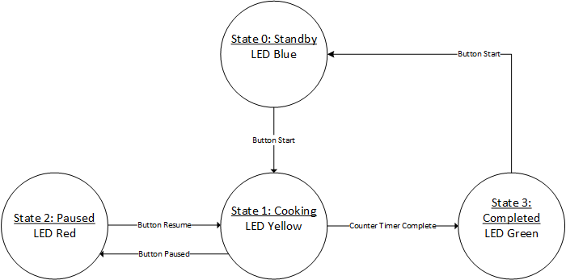
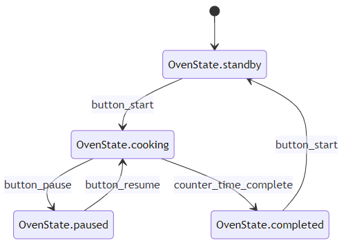

# Content

- [Microwave Oven in Finite State Machine (FSM)](#microwave-oven-in-finite-state-machine-fsm)
- [State](#state)
- [Transitions](#transitions)
- [Microwave Oven State Diagram](#microwave-oven-state-diagram)
- [ROHD FSM](#rohd-fsm)
- [FSM Simulation](#fsm-simulation)
- [Exercise](#exercise)

## Learning Outcome

In this chapter:

- You will learn how to create a microwave oven finite state machine using ROHD abstraction API.

## Microwave Oven in Finite State Machine (FSM)

Today, we going to develop an Microwave Oven FSM using ROHD. Since its just a case study, let make this microwave oven only consists of 4 states (standby, cooking, paused and completed).

### State

- Standby: LED Blue. The initial state, where the oven is idle and waiting for user input
- Cooking: LED Yellow. The state in which the oven is actively cooking the food
- Paused: LED Red. The state in which cooking is temporarily suspended, but can be resumed.
- Completed: LED Green. The state in which the oven has finished cooking the food.

### Transitions

Transitions between states would be triggered by events such as button presses or sensor readings. For example, when the "start" button is pressed, the FSM would transition from "standby" to "cooking." When the cooking time has expired, it would transition from "cooking" to "completed." If the "pause" button is pressed while in the "cooking" state, the FSM would transition to "paused." And if the "resume" button is pressed while in the "paused" state, the FSM would transition back to "cooking."

## Microwave Oven State Diagram



## ROHD FSM

In ROHD, there are abstraction level of writting FSM. Yes, you can definitely wrote the code using Sequential and Combinational like previous chapter. But, today we want to see how we can leverage the abstraction layer provided in ROHD to quickly create the Oven FSM above.

First, we want to import the ROHD package and also `counter` module. We can use the counter interface we created last session.

```dart
import 'package:rohd/rohd.dart';
import './counter_interface.dart';
```

We also want to represent the standby, cooking, paused, and completed states.

Next, we can also use enums to represent the LED light on the oven. Similar to buttons, we want to also encoded the LED light with customs value instead.

```dart
enum OvenState { standby, cooking, paused, completed }
```

Then, its time to create our `OvenModule`. Let start by creating the Module class.

```dart
class OvenModule extends Module {
  OvenModule(): super(name: 'OvenModule') {
    // logic here
  }
}
```

In ROHD, we can use `StateMachine` API library. The `StateMachine` constructs a simple FSM, using the `clk` and `reset` signals. Also accepts the `reset` state to transition to `resetState` along with the List of _states of the FSM. Later, we will also need to create a List of `state` and send to the StateMachine.

Let start by intitialize a variable called `_oven` that is `StateMachine` with `StateIdentifier` as  `OvenState`.

Besides, we can use a simple hashmap to map over the button and LED value to integer.

```dart
class OvenModule extends Module {
  late StateMachine<OvenState> _oven;

  // A hashmap that represent button value
  final Map<String, int> btnVal = {
    'start': 0,
    'pause': 1,
    'resume': 2,
  };

  // A hashmap that represent LED value
  final Map<String, int> ledLight = {
    'yellow': 0,
    'blue': 1,
    'red': 2,
    'green': 3
  };

  OvenModule(): super(name: 'OvenModule') {
    // logic here
  }
}
```

This oven will receive button and reset signal as input and output a led light. Let add the inputs and output port now. Also create a getter for the LED as the output.

Let also create an internal clock generator `clk` inside the module. This clk generator will be shared with the FSM and `counter` module. Let instantiate the counter module, together with internal signals reset `counterReset` and enable `en`.

```dart
class OvenModule extends Module {
  late StateMachine<OvenState> _oven;
  Logic get led => output('led');

  OvenModule(): super(name: 'OvenModule') {
    // FSM input and output
    button = addInput('button', button, width: button.width);
    reset = addInput('reset', reset);
    final led = addOutput('led', width: 8);
    
    // Counter internal signals
    final clk = SimpleClockGenerator(10).clk;
    final counterReset = Logic(name: 'counter_reset');
    final en = Logic(name: 'counter_en');
    final counterInterface = CounterInterface();
    counterInterface.clk <= clk;
    counterInterface.en <= en;
    counterInterface.reset <= counterReset;

    final counter = Counter(counterInterface);
  }
}
```

Let start creating the FSM `State`. FSM `State` represent a state named `identifier` with a definition of `events` and `actions` associated with that state.

- `identifier`: Identifer or name of the state.
- `events`: A map of the possible conditions that might be true and the next state that the FSM needs to transition to in each of those cases.
- `actions`: Actions to perform while the FSM is in this state.

```dart
State(StateIdentifier identifier, {required Map<Logic, StateIdentifier> events, required List<Conditional> actions});
```

Example, State 0 - Standby State will have the below properties:

1. identifier: `OvenState.standby`
2. events:
key: `Logic(name: 'button_start')..gets(button.eq(Const(Button.start.value, width: button.width)))`
value: `OvenState.cooking`
3. actions: `[led < LEDLight.blue.value, counterReset < 1, end < 0 ]`

The other states are coded as below. The code are well documented with comments below.

```dart
final states = [
  // identifier: standby state, represent by `OvenState.standby`.
  State<OvenState>(OvenState.standby,
    // events:
    // When the button `start` is pressed during standby state,
    // OvenState will changed to `OvenState.cooking` state.
    events: {
      Logic(name: 'button_start')
            ..gets(button
                .eq(Const(Button.start.value, width: button.width))):
          OvenState.cooking,
    },
    // actions:
    // During the standby state, `led` is change to blue; timer's
    // `counterReset` is set to 1 (Reset the timer);
    // timer's `en` is set to 0 (Disable value update).
    actions: [
      led < LEDLight.blue.value,
      counterReset < 1,
      en < 0,
    ]),

  // identifier: cooking state, represent by `OvenState.cooking`.
  State<OvenState>(OvenState.cooking,
    // events:
    // When the button `paused` is pressed during cooking state,
    // OvenState will changed to `OvenState.paused` state.
    //
    // When the button `counter` time is elapsed during cooking state,
    // OvenState will changed to `OvenState.completed` state.
    events: {
      Logic(name: 'button_pause')
            ..gets(button
                .eq(Const(Button.pause.value, width: button.width))):
          OvenState.paused,
      Logic(name: 'counter_time_complete')..gets(counterInterface.val.eq(4)):
          OvenState.completed
    },
    // actions:
    // During the cooking state, `led` is change to yellow; timer's
    // `counterReset` is set to 0 (Do not reset);
    // timer's `en` is set to 1 (Enable value update).
    actions: [
      led < LEDLight.yellow.value,
      counterReset < 0,
      en < 1,
    ]),

  // identifier: paused state, represent by `OvenState.paused`.
  State<OvenState>(OvenState.paused,
    // events:
    // When the button `resume` is pressed during paused state,
    // OvenState will changed to `OvenState.cooking` state.
    events: {
      Logic(name: 'button_resume')
            ..gets(button
                .eq(Const(Button.resume.value, width: button.width))):
          OvenState.cooking
    },
    // actions:
    // During the paused state, `led` is change to red; timer's
    // `counterReset` is set to 0 (Do not reset);
    // timer's `en` is set to 0 (Disable value update).
    actions: [
      led < LEDLight.red.value,
      counterReset < 0,
      en < 0,
    ]),

  // identifier: completed state, represent by `OvenState.completed`.
  State<OvenState>(OvenState.completed,
    // events:
    // When the button `start` is pressed during completed state,
    // OvenState will changed to `OvenState.standby` state.
    events: {
      Logic(name: 'button_start')
            ..gets(button
                .eq(Const(Button.start.value, width: button.width))):
          OvenState.standby
    },
    // actions:
    // During the start state, `led` is change to green; timer's
    // `counterReset` is set to 1 (Reset value);
    // timer's `en` is set to 0 (Disable value update).
    actions: [
      led < LEDLight.green.value,
      counterReset < 1,
      en < 0,
    ])
];
```

By now, you already have a list of `state` ready to be passed to the `StateMachine`. Let assign the the `state` to the StateMachine declared. Note that, we also passed `OvenState.standby` to the StateMachine to understand that is the State when reset signal is given.

ROHD FSM abstraction come with state diagram generator using mermaid. We can create a markdown file using the function `generateDiagram()`. You can install mermaid extension in VSCode to preview the diagram.

```dart
_oven = StateMachine<OvenState>(clk, reset, OvenState.standby, states);

_oven.generateDiagram(outputPath: 'doc/tutorials/chapter_8/oven_fsm.md');
```

Then, you can preview the generated fsm diagram.



## FSM Simulation

Let test and simulate our FSM module. First, let create a main function and instantiate the FSM module together with the inputs logic.

```dart
Future<void> main({bool noPrint = false}) async {
  final button = Logic(name: 'button', width: 2);
  final reset = Logic(name: 'reset');
  final oven = OvenModule(button, reset);
}
```

Before we start the simulation, we need to build the module using `await oven.build()`. Let start by inject value of 1 to `reset` to not allows the FSM start.

```dart
await oven.build();
reset.inject(1);
```

Let also attach a `WaveDumper` to preview what is the waveform and what happened during the Simulation.

```dart
if (!noPrint) {
  WaveDumper(oven, outputPath: 'oven.vcd');
}
```

Let add a listener to the to listen to the `Steam` and print the outputs when the value changed. This can be achieved by `.changed.listen()` function.

```dart
if (!noPrint) {
  // We can listen to the streams on LED light changes based on time.
  oven.led.changed.listen((event) {
    // Get the led light enum name from LogicValue.
    final ledVal = LEDLight.values[event.newValue.toInt()].name;

    // Print the Simulator time when the LED light changes.
    print('@t=${Simulator.time}, LED changed to: $ledVal');
  });
}
```

Now, let start the simulation. At time 25, we want to drop the reset and press on the start button.

```dart
// Drop reset at time 25.
Simulator.registerAction(25, () => reset.put(0));

// Press button start => `00` at time 25.
Simulator.registerAction(25, () {
  button.put(Button.start.value);
});
```

Then, we want to press the pause button at time 50 and press resume button at time 70.

```dart
// Press button pause => `01` at time 50.
Simulator.registerAction(50, () {
  button.put(Button.pause.value);
});

// Press button resume => `10` at time 70.
Simulator.registerAction(70, () {
  button.put(Button.resume.value);
});
```

Finally, we want to `setMaxSimTime` to 120 and register a print function on time 120 to indicate that the Simulation completed.

```dart
// Set a maximum time for the simulation so it doesn't keep running forever.
Simulator.setMaxSimTime(120);

// Kick off the simulation.
await Simulator.run();
```

Well, that is for the FSM. Hope you enjoyed the tutorials. You can find the executable version of code at [oven_fsm.dart](./oven_fsm.dart).

## Exercise

1. Toy Capsule Finite State Machine

Let create a toy capsule vending machine. Consider a toy capsule vending machine that dispenses a single type of toy capsule. The vending machine can be in one of three states.

- Idle: This is the initial state of the vending machine, where it is waiting for a customer to insert coin.
- Coin Inserted: Once the customer inserts a coin, the vending machine moves into this state. The machine now waits for the customer to press dispense.
- Dispensing: If the customer press the dispense button, the machine moves into this state, where it dispenses the toy capsule and then returns to the "Idle" state.

In this case study, the transitions between the states are as follows:

- If the vending machine is in "idle" state and a coin is inserted, It transitions to the "Coin Inserted" State.
- If the vending machine is in "Coin Inserted" state and a dispense button is pressed, it transitions to the "Dispensing" state.
- If the vending machine is in the "Dispensing" state, it dispenses the toy capsule and transitions back to the Idle State.

Answer to this exercise can be found at [answers/exercise_2_toycapsule_fsm.dart](./answers/exercise_2_toycapsule_fsm.dart)
