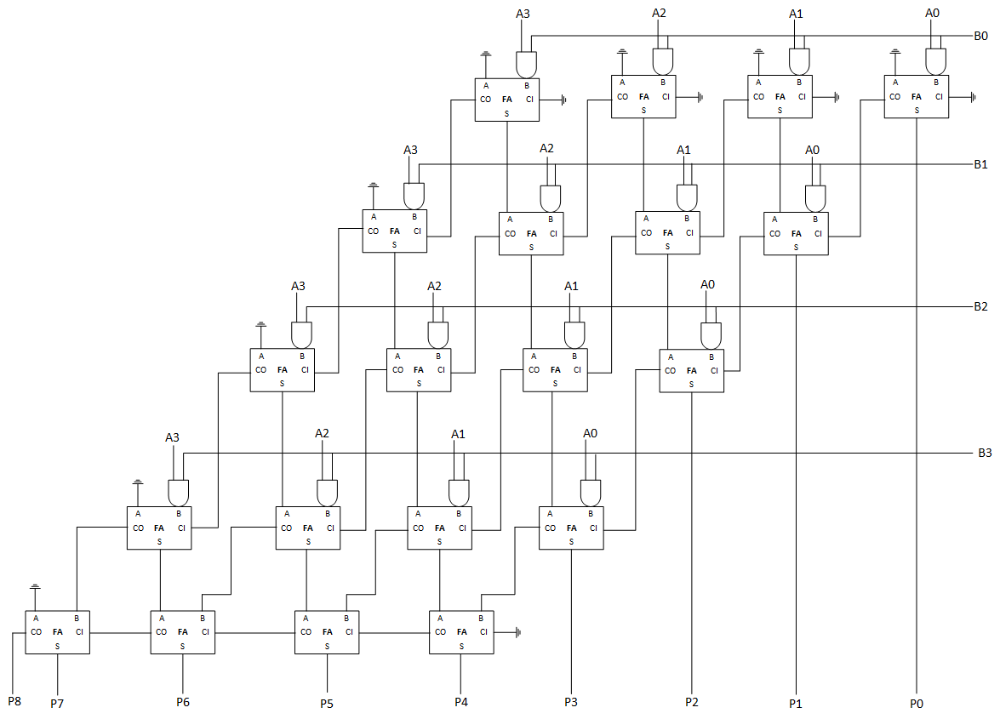

# Content

- [ROHD Pipelines](#rohd-pipelines)
- [Carry Save Multiplier 4 x 4](#carry-save-multiplier-4-x-4)
- [Exercise](#exercise)

## Learning Outcome

In this chapter:

- You will learn how to use ROHD pipeline abstraction API to build Carry Save Multiplier (CSM).

## ROHD Pipelines

ROHD has a built-in syntax for handling pipelines in a simple & refactorable way. The example below shows a three-stage pipeline which adds 1 three times. Note that `Pipeline` consumes a clock and a list of stages, which are each a `List<Conditional> Function(PipelineStageInfo p)`, where `PipelineStageInfo` has information on the value of a given signal in that stage. The `List<Conditional>` the same type of procedural code that can be placed in `Combinational`.

```dart
Logic a;
var pipeline = Pipeline(clk,
  stages: [
    (p) => [
      // the first time `get` is called, `a` is automatically pipelined
      p.get(a) < p.get(a) + 1
    ],
    (p) => [
      p.get(a) < p.get(a) + 1
    ],
    (p) => [
      p.get(a) < p.get(a) + 1
    ],
  ]
);
var b = pipeline.get(a); // the output of the pipeline
```

This pipeline is very easy to refractor. If we wanted to merge the last two stages, we could simple rewrite it as:

```dart
Logic a;
var pipeline = Pipeline(clk,
  stages: [
    (p) => [
      p.get(a) < p.get(a) + 1
    ],
    (p) => [
      p.get(a) < p.get(a) + 1,
      p.get(a) < p.get(a) + 1
    ],
  ]
);
var b = pipeline.get(a);
```

You can also optionally add stalls and reset values for signals in the pipeline. Any signal not accessed via the `PipelineStageInfo` object is just accessed as normal, so other logic can optionally sit outside of the pipeline object.

ROHD also includes a version of `Pipeline` that support a ready/valid protocol called `ReadyValidPipeline`. The syntax looks the same, but has some additional parameters for readys and valids.

## Carry Save Multiplier (4 x 4)

Carry Save Multiplier is a digital circuit used for multiplying two binary numbers. It is a specialized multiplication technique that is commonly employed in high-performance arithmetic units, particularly in digital signal processing (DSP) applications.

The carry-save multiplier approach aims to enhance the speed and efficiency of the multiplication operation by breaking it down into smaller parallel operations. Instead of directly multiplying the etire multiplicand and mulltiplier, the carry-save multiplier splits them into smaller components and performs independent multiplications on each components.

We can build carry save multiplier using carry save adder built in [chapter 5](../chapter_5/00_basic_modules.md). The diagram below shows the architectures of the carry save multiplier built using Full Adder and N-Bit Adder.



Assuming that we have binary input A = 1010 (decimal: 10) and B = 1110 (decimal: 14), the final result would be 10001100 (decimal: 140).

The **first stage** of the carry-save multiplier consists of a Full Adder that takes in the AND gate of `Ax` and `B0`, where x is the bit position of the input a.

In stage 0, the full adder takes in:

- Inputs
  - A: 0
  - B: AND(Ax, B0)
  - C-IN: 0

In the stage 2 to 4, the full adder takes:

- Inputs
  - A: Output **Sum** from previous stage
  - B: AND(Ax, By), where x is the single bit of A, while y is the bits based on stage.
  - C-IN: Output **carry-out** from previous stage

As shown in the diagram, the first index of the FA always takes 0 as input A, and the **final stage** consists of the **N-Bit Adder** we created previously.
Note that n-bit adder is also called as ripple carry adder.

Let's start by creating the `CarrySaveMultiplier` module. The module takes inputs `a`, `b`, `reset` and a `clk`, and returns an output port named `product`. We will also need two internal signals, `rCarryA` and `rCarryB`, which will contain the signals to be passed to the nBitAdder or ripple carry adder later in the final stage.

Let's also created two List of Logic that save `sum` and `carry` from each of the stage. Since we will be using ROHD pipeline for this module, let also created a global variable for ROHD pipeline.

We can also create a getter function that get the output of `product`.

```dart
class CarrySaveMultiplier extends Module {
  final List<Logic> sum =
      List.generate(8, (index) => Logic(name: 'sum_$index'));
  final List<Logic> carry =
      List.generate(8, (index) => Logic(name: 'carry_$index'));

  late final Pipeline pipeline;

  CarrySaveMultiplier(Logic valA, Logic valB, Logic clk, Logic reset,
      {super.name = 'carry_save_multiplier'}) {
    // Declare Input Node
    valA = addInput('a', valA, width: valA.width);
    valB = addInput('b', valB, width: valB.width);
    clk = addInput('clk', clk);
    reset = addInput('reset', reset);

    final product = addOutput('product', width: a.width + b.width + 1);

    final rCarryA = Logic(name: 'rcarry_a', width: valA.width);
    final rCarryB = Logic(name: 'rcarry_b', width: valB.width);
  }

  Logic get product => output('product');
}
```

Since we will be using `FullAdder` and `NBitAdder` modules in chapter 5, we need to import them.

```dart
import '../chapter_5/n_bit_adder.dart';
```

To implement the pipeline, we need to declare a `Pipeline` object with a clock `clk` and a list of stages. Each stage can be thought of as a row, and each row will have `(a.width - 1) + row` columns.

For the first stage or row of `FullAdder`, we need to set `a` and `c-in` to 0. Additionally, for every first column, `a` will also be 0. Therefore, we can represent `a` as `column == (a.width - 1) + row || row == 0 ? Const(0) : p.get(sum[column])`. Similarly, we can represent `carryIn` as `row == 0 ? Const(0) : p.get(carry[column - 1])`.

Note that we use `p.get()` to retrieve data from the previous pipeline stage. As for `b`, we can represent it using a simple `AND` operation: `a[column - row] & b[row]`.

Summary:

- a: `column == (a.width - 1) + row || row == 0 ? Const(0) : p.get(sum[column])`
- b: `a[column - row] & b[row]`
- c-in: `row == 0 ? Const(0) : p.get(carry[column - 1])`

In each pipeline stage, we can use `...List.generate()` to generate the `FullAdder`.

```dart
pipeline = Pipeline(clk,
  stages: [
    ...List.generate(
      valB.width,
      (row) => (p) {
        final columnAdder = <Conditional>[];
        final maxIndexA = (valA.width - 1) + row;

        for (var column = maxIndexA; column >= row; column--) {
          final fullAdder = FullAdder(
                  a: column == maxIndexA || row == 0
                      ? Const(0)
                      : p.get(sum[column]),
                  b: p.get(valA)[column - row] & p.get(valB)[row],
                  carryIn: row == 0 ? Const(0) : p.get(carry[column - 1]))
              .fullAdderRes;

          columnAdder
            ..add(p.get(carry[column]) < fullAdder.cOut)
            ..add(p.get(sum[column]) < fullAdder.sum);
        }

        return columnAdder;
      },
    )],
);
```

We have successfully created stages 0 to 3. Next, we manually add the final stage where we swizzle the `sum` and `carry` and connect them to `rCarryA` and `rCarryB`, respectively.

```dart
(p) => [
  p.get(rCarryA) <
      <Logic>[
        Const(0),
        ...List.generate(
            valA.width - 1,
            (index) =>
                p.get(sum[(valA.width + valB.width - 2) - index]))
      ].swizzle(),
  p.get(rCarryB) <
      <Logic>[
        ...List.generate(
            valA.width,
            (index) =>
                p.get(carry[(valA.width + valB.width - 2) - index]))
      ].swizzle()
],
```

Also not to forget to set the reset signals in pipeline. Your final version of the pipeline will look like this.

```dart
pipeline = Pipeline(
  clk,
  stages: [
    ...List.generate(
      valB.width,
      (row) => (p) {
        final columnAdder = <Conditional>[];
        final maxIndexA = (valA.width - 1) + row;

        for (var column = maxIndexA; column >= row; column--) {
          final fullAdder = FullAdder(
                  a: column == maxIndexA || row == 0
                      ? Const(0)
                      : p.get(sum[column]),
                  b: p.get(valA)[column - row] & p.get(valB)[row],
                  carryIn: row == 0 ? Const(0) : p.get(carry[column - 1]))
              .fullAdderRes;

          columnAdder
            ..add(p.get(carry[column]) < fullAdder.cOut)
            ..add(p.get(sum[column]) < fullAdder.sum);
        }

        return columnAdder;
      },
    ),
    (p) => [
          p.get(rCarryA) <
              <Logic>[
                Const(0),
                ...List.generate(
                    valA.width - 1,
                    (index) =>
                        p.get(sum[(valA.width + valB.width - 2) - index]))
              ].swizzle(),
          p.get(rCarryB) <
              <Logic>[
                ...List.generate(
                    valA.width,
                    (index) =>
                        p.get(carry[(valA.width + valB.width - 2) - index]))
              ].swizzle()
        ],
  ],
  reset: reset,
  resetValues: {product: Const(0)},
);
```

To obtain our final result, we can instantiate the `NBitAdder` module and pass `rCarryA` and `rCarryB` to the module. Finally, we need to swizzle the results from `nBitAdder` and the last four bits from the pipeline.

```dart
final nBitAdder = NBitAdder(
      pipeline.get(rCarryA),
      pipeline.get(rCarryB),
);

product <=
<Logic>[
  ...List.generate(
    valA.width + 1,
    (index) => nBitAdder.sum[(valA.width) - index],
  ),
  ...List.generate(
    valA.width,
    (index) => pipeline.get(sum[valA.width - index - 1]),
  )
].swizzle();
```

We can test and simulate the final output by creating the `main()` function as below:

```dart
void main() async {
  final a = Logic(name: 'a', width: 4);
  final b = Logic(name: 'b', width: 4);
  final reset = Logic(name: 'reset');
  final clk = SimpleClockGenerator(10).clk;

  final csm = CarrySaveMultiplier(a, b, clk, reset);

  await csm.build();

  // after one cycle, change the value of a and b
  a.inject(10);
  b.inject(14);
  reset.inject(1);

  // Attach a waveform dumper so we can see what happens.
  WaveDumper(csm, outputPath: 'csm.vcd');

  Simulator.registerAction(10, () {
    reset.inject(0);
  });

  Simulator.registerAction(30, () {
    a.put(10);
    b.put(11);
  });

  Simulator.registerAction(60, () {
    a.put(10);
    b.put(6);
  });

  csm.product.changed.listen((event) {
    print('@t=${Simulator.time}, product is: ${event.newValue.toInt()}');
  });

  Simulator.setMaxSimTime(150);

  await Simulator.run();
}
```

Well, that is for the pipeline. Hope you enjoyed the tutorials. You can find the executable version of code at [carry_save_multiplier.dart](./carry_save_multiplier.dart).

## Exercise

1. Can you create a simple 4-stages pipeline that perform the following operation on each stage:

`a + (a * stage_num)`

where `a` is an input variable from user, and `stage_num` takes the values of 0 to 3 based on it current stage.

In each stage, the pipeline should multiply the input `a` by the stage number and add the result to the input `a` to obtain the stage output.

Answer to this exercise can be found at [answers/exercise_3_pipeline.dart](./answers/exercise_3_pipeline.dart)
