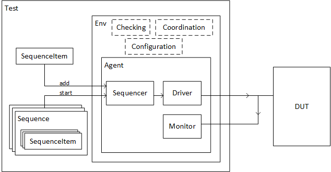

# ROHD Verification Framework

In this chapter, we are going to learn how to use ROHD-VF, a verification framework that are built upon Rapid Open Hardware Development (ROHD) framework. ROHD-VF offers testbench in a way that are similar to UVM. For those who are unfamiliar with UVM, worry not as we will covered it piece by piece as we move along with this tutorial.

## Testbenches

A testbench is a software used to interact with and test a device under test (DUT). ROHD-VF testbenches are organized in a modular and extenable way using simple base classes which have specific roles. Below are the diagram of the ROHD-VF testbench.



### Constructing Objects

ROHD-VF does not comes with a built-in "factory" (like UVM) for constructing Components in the testbench. But, it is a good idea to build a testbench with modularity and configurability in mind. There is no restriction against using factory design pattern to build a test bench if you feel that are the right approach.

#### Component's Phases

Most of the setup occur in the constuctor of the object. ROHD-VF comes with some phasing (similar to UVM) to help configure, connect and run a testbench in coordinated steps. Every Component goes through phases.

- The constructor
  - Clearly enumerate what is required to build the component as part of the constructor parameters.
  - Construct any sub-components
- `void build()`
  - A function which get called when the test is started, but before the `Simulator` running
- `Future<void> run`(Phase phase)
  - A time-consuming function which starts executing when the test and `Simulator` are running.
  - Use `phase` to create `Objection`s.
- `void check()`
  - A function that gets called at the end of the simulation, for checking the end state for correctness

#### Component

A `component` is an object which holds a fixed hierarchical position in the testbench. All the below classes extend `Component`.

- **Monitor**
  - A `Monitor` is responsible for watching an interface and reporting out interesting events onto an output stream. This bridges the hardware world into an object that can be manipulated in the testbench. Many things can listen to a `Minotor`, often logging or checking logic.
- **Driver**
  - A driver is responsible for converting a `SequenceItem` into signal transitions on a hardware interface. The driver accepts incoming items from a `Sequencer`.
- **Sequencer**
  - A `Sequencer` accepts `SequenceItem`s from stimulus sources (e.g. `Sequence`s) and determine how to pass them to the appropriate `Driver`(s). The default behaviour of a `Sequencer` is to directly pass them to the `Driver` immediately, but can be changed.
- **Agent**
  - The `Agent` is a wrapper for related components, often which all look at a single interface or set of interfaces.
- **Env**
  - The `Env` is a wrapper for a collection of related components, often each with their own hierarchy. `Env`s are usually composed of `Agent`s, scoreboards, configuration & coordination logic, other smaller `Env`s, etc.
- **Test**
  - A `Test` is like a top-level testing entity that contains the top testbench `Env` and kicks off `Sequence`s. Only one `Test` should be running at a time. The `Test` also containsa central `Random` object to be used for randomization in a reproducible way.

#### Stimulus

Sending stimulus through the testbench to the device undertest is done by passing `SequenceItem`s through sequencer to `Driver`.

- **SequenceItem**
  - A `SequenceItem` represents a collection of information to transmit across an interface. A typical use case would be sending a collection of `SequenceItem`s in a specific order.
- **Sequence**
  - A `Sequence` is a modular object which has instructions for how to send `SequenceItem`s to a `Sequencer`. A typical use case would be sending a collection of `SequenceItem`s in a specific order.

#### Logging

ROHD-VF uses Dart `logging` package for all logging. It comes with a variety of verbosity levels and excellent customizability.

The `Test` object contains settings for `killLevel` and `failLevel` which will, repectively, immediately end the test or cause a test failure when the simulation finishes running. These levels are associated with the levels from the `logging` package.

To log a message from any ROHD-VF object or component, just use the inherited `logger` object.

## Test a Counter module with ROHD-VF

Today, we are going to test a `Counter` module using ROHD-VF. The `Counter` module can be found on the chapter 8 interface. Let start with creating a test plan. Say that, we want to test:

- If the value of the Counter are increasing in every cycle

First and foremost, let start by creating a top level testbench.

```dart
// The DUT to test.
class TopTB {
  // Instance of DUT.
  late final MyCounter counter;

  static const int width = 8;

  TopTB() {
    // Build an instance of the interface to be used in Counter.
    final intf = MyCounterInterface();

    // connect a generated clock to the interface.
    intf.clk <= SimpleClockGenerator(10).clk;

    // Create the DUT, passing it to our interface.
    counter = MyCounter(intf);
  }
}
```

Next, we need to know what is the sequence item that we want to pass to the Test. In our case, our sequence item will consists of enable of 1 or 0 which represented using boolean True or False.  If the enabled is True, the Counter will start and stop when enabled is False.

```dart
class MySeqItem extends SequenceItem {
  // your control pin
  // in this case is enable pin
  final bool _enable;
  MySeqItem(this._enable);

  int get en => _enable ? 1 : 0;

  @override
  String toString() => 'enable=$_enable';
}
```

After define our sequence item, we want to explicitly define the type that are going to the Sequencer.

```dart
class MySequencer extends Sequencer<MySeqItem> {
  MySequencer(Component parent, {String name = 'mySequencer'})
      : super(name, parent);
}
```

Since Sequencer will take input from a sequence, we also need to declare our own Sequence that can be used by the Sequencer.

```dart
class MySequence extends Sequence {
  //------------------------ Comment Out later ---------------------------
  final int numRepeat;

  MySequence(this.numRepeat, {String name = 'mySequence'}) : super(name);

  @override
  Future<void> body(Sequencer sequencer) async {
    final mySequencer = sequencer as MySequencer;
    for (var i = 0; i < numRepeat; i++) {
      mySequencer.add(MySeqItem(true));
    }
  }
  //---------------------------------------------------------------------
}
```

Now, we have finished declared all the Stimulus. We can hop into constructing our `Agent`. Agent consists of a sequencer, driver and monitor. We had defined our Sequencer, so now we want to implement the driver and monitor.

You can have several Monitor in ROHD-VF testbench. Let start by having a Monitor that monitor for Counter's Value. Let add the interface value to the stream by using the `add()` function. We can define it at the `run()` function.

```dart
class MyValueMonitor extends Monitor<LogicValue> {
  /// Instance of the [Interface] to the DUT.
  final MyCounterInterface intf;

  MyValueMonitor(this.intf, Component parent, {String name = 'myValueMonitor'})
      : super(name, parent);

  @override
  Future<void> run(Phase phase) async {
    unawaited(super.run(phase));

    // Every positive edge of the clock
    intf.clk.posedge.listen((event) {
      // Add the pin/port you want to monitor here.
      add(intf.val.value);
    });
  }
}
```

Next, we will need to create a `driver` that drive the value from `Sequencer`. In your Driver, you need to declare the interface and the pending items from Queue. In your run function, basically what you do is listen to the sequencer stream to retrived sequence item and add to the queue. After that, we will drive the sequence item in either positive and negative edge of the clock.

```dart
class MyDriver extends Driver<MySeqItem> {
  // Your interface
  final MyCounterInterface intf;

  // Keep a queue of items from the sequencer to be driven when desired
  final Queue<MySeqItem> _pendingItems = Queue<MySeqItem>();

  Objection? _driverObjection;

  MyDriver(this.intf, MySequencer sequencer, Component parent,
      {String name = 'counterDriver'})
      : super(name, parent, sequencer: sequencer);

  @override
  Future<void> run(Phase phase) async {
    unawaited(super.run(phase));

    // Listen to new items coming from the sequencer, and add them to a queue
    sequencer.stream.listen((newItem) {
      _driverObjection ??= phase.raiseObjection('my_driver')
        ..dropped.then((value) => logger.fine('Driver objection dropped'));
      _pendingItems.add(newItem);
    });

    // Every clock negative edge, drive the next pending item if it exists
    // TODO: Let user choose to drive at posedge or negedge
    intf.clk.negedge.listen((args) {
      if (_pendingItems.isNotEmpty) {
        final nextItem = _pendingItems.removeFirst();
        drive(nextItem);
        if (_pendingItems.isEmpty) {
          _driverObjection?.drop();
          _driverObjection = null;
        }
      }
    });
  }

  // Translate a SequenceItem into pin wiggles
  // use inject instead of put here
  void drive(MySeqItem? item) {
    if (item == null) {
      intf.en.inject(0);
    } else {
      intf.en.inject(item.en);
    }
  }
}
```

Lastly, we will need to create an Agent that used the sequencer, monitor, and driver. Basically, we just need to instantiate it by extending Agent class.

```dart
class MyAgent extends Agent {
  final MyCounterInterface intf;
  late final MySequencer sequencer;
  late final MyDriver driver;
  late final MyValueMonitor valueMonitor;

  MyAgent(this.intf, Component parent, {String name = 'myAgent'})
      : super(name, parent) {
    sequencer = MySequencer(this);
    driver = MyDriver(intf, sequencer, this);
    valueMonitor = MyValueMonitor(intf, this);
  }
}
```

The next things we want to do is checking for the test case using Scoreboard. We are expecting the value to keep on increasing when enabled pin is 1.

```dart
class MyScoreboard extends Component {
  /// A stream which sends out the current value out of the counter once per
  /// cycle.
  final Stream<LogicValue> valueStream;

  /// An instance of the interface to [MyCounter].
  final MyCounterInterface intf;

  MyScoreboard(this.valueStream, this.intf, Component parent,
      {String name = 'myScoreboard'})
      : super(name, parent);

  /// The most recent value received on [valueStream].
  int? _seenValue;

  /// The value seen last time from [valueStream].
  int _lastSeenValue = 0;

  @override
  Future<void> run(Phase phase) async {
    unawaited(super.run(phase));

    // record the value we saw this cycle
    valueStream.listen((event) {
      _seenValue = event.toInt();
    });

    // check values on negative edge
    intf.clk.negedge.listen((event) {
      if (intf.en.value == LogicValue.one) {
        int expected;

        // handle counter overflow
        if (_lastSeenValue == (1 << intf.width) - 1) {
          expected = 0;
        } else {
          expected = _lastSeenValue + 1;
        }

        final matchesExpectations = _seenValue == expected;

        if (!matchesExpectations) {
          logger.severe('Expected $expected but saw $_seenValue');
        } else {
          logger.finest('Counter value matches expectations with $_seenValue');
        }

        _lastSeenValue = _seenValue ?? 0;
      }
    });
  }
}
```

The same things like Agent, we want to wrap everything to the Environment `Env`. Our Env will contains agent, scoreboard and interface. 

```dart
class MyEnv extends Env {
  final MyCounterInterface intf;

  late final MyAgent agent;

  late final MyScoreboard scoreboard;

  MyEnv(this.intf, Component parent, {String name = 'myEnv'})
      : super(name, parent) {
    agent = MyAgent(intf, this);
    scoreboard = MyScoreboard(agent.valueMonitor.stream, intf, this);
  }

  @override
  Future<void> run(Phase phase) async {
    unawaited(super.run(phase));

    // Listen to the output of the monitor for some logging
    agent.valueMonitor.stream.listen((event) {
      logger.finer('Detected value on counter: $event');
    });
  }
}
```

Now, let wrap and connect everythings through Test. In the run function, we can set the flow on how we going to do the test.

```dart
class MyTest extends Test {
  // instantiate the DUT to test
  final MyCounter dut;

  // test environment for [dut].
  late final MyEnv env;

  // a private, local pointer to the test environment's [Sequencer].
  late final MySequencer _mySequencer;

  MyTest(this.dut, {String name = 'myTest'}) : super(name) {
    // instantiate the environment
    env = MyEnv(dut.counterintf, this);

    // point the sequencer to the agent's sequencer
    _mySequencer = env.agent.sequencer;
  }

  Future<void> waitNegedges(int numCycles) async {
    for (var i = 0; i < numCycles; i++) {
      await dut.clk.nextNegedge;
    }
  }

  @override
  Future<void> run(Phase phase) async {
    unawaited(super.run(phase));

    // Raise an objection at the start of the test so that the
    // simulation doesn't end before stimulus is injected
    final obj = phase.raiseObjection('my_test');

    logger.info('Running the test...');

    // Add some simple reset behavior at specified timestamps
    Simulator.registerAction(1, () {
      dut.counterintf.reset.put(0);
    });
    Simulator.registerAction(3, () {
      dut.counterintf.reset.put(1);
    });
    Simulator.registerAction(35, () {
      dut.counterintf.reset.put(0);
    });

    // Add an individual SequenceItem to set enable to 0 at the start
    _mySequencer.add(MySeqItem(false));

    // Wait for the next negative edge of reset
    await dut.counterintf.reset.nextNegedge;

    // Wait 0 cycles
    await waitNegedges(0);

    // Kick off a sequence on the sequencer
    await _mySequencer.start(MySequence(5));

    logger.info('Done adding stimulus to the sequencer');

    // Done adding stimulus, we can drop our objection now
    obj.drop();
  }
}
```

As usual, we can create an entry point main() and start the Test.

```dart
Future<void> main({Level loggerLevel = Level.FINER}) async {
  // set the logger level
  Logger.root.level = loggerLevel;

  // create the testbench
  final tb = TopTB();

  // Build the DUT top level module
  await tb.counter.build();

  // dump wave here
  WaveDumper(tb.counter);

  // Set a maximum simulation time so it doesn't run forever
  Simulator.setMaxSimTime(300);

  // Create and start the test!
  final test = MyTest(tb.counter);
  await test.start();
}
```
