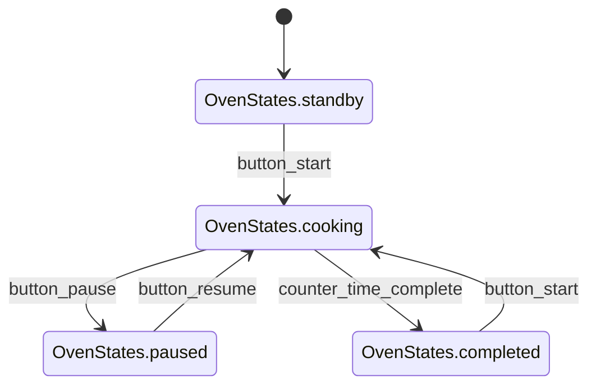

```mermaid
stateDiagram

[*] --> OvenStates.standby
OvenStates.standby --> OvenStates.cooking: button_start
OvenStates.cooking --> OvenStates.paused: button_pause
OvenStates.cooking --> OvenStates.completed: counter_time_complete
OvenStates.paused --> OvenStates.cooking: button_resume
OvenStates.completed --> OvenStates.cooking: button_start

```
