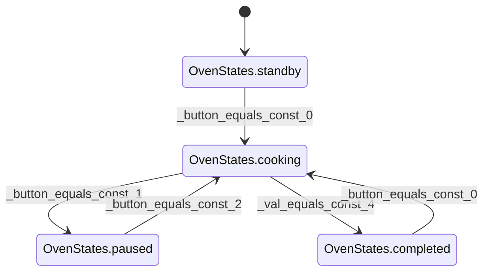

```mermaid
stateDiagram

[*] --> OvenStates.standby
OvenStates.standby --> OvenStates.cooking: _button_equals_const_0
OvenStates.cooking --> OvenStates.paused: _button_equals_const_1
OvenStates.cooking --> OvenStates.completed: _val_equals_const_4
OvenStates.paused --> OvenStates.cooking: _button_equals_const_2
OvenStates.completed --> OvenStates.cooking: _button_equals_const_0

```
